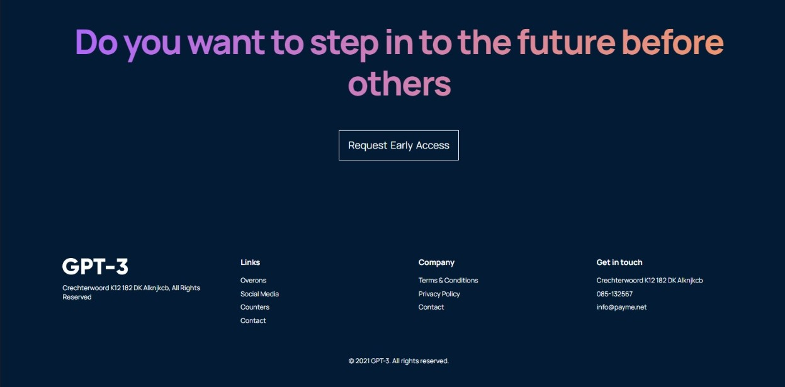

# GPT3 APP

Responsive Modern UI

npm install to add node modules and libraries - npm start to run this proyect

- React JS
- CSS
- BEM CSS methodology

FIGMA Design: https://www.figma.com/file/lz9lLpFHMxHm2odnwM3R0z/gpt3?node-id=0%3A15

## Desktop Version

## Mobile Version

